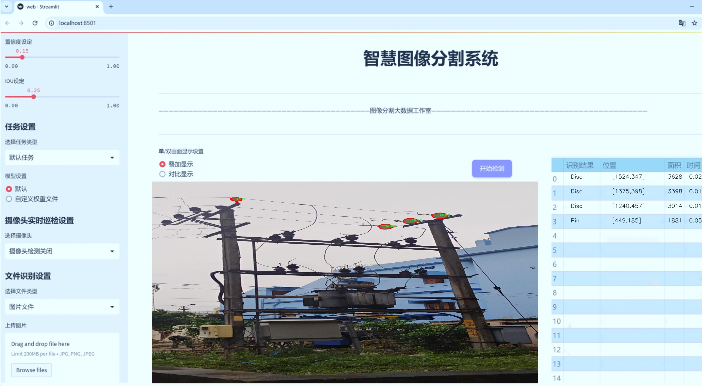
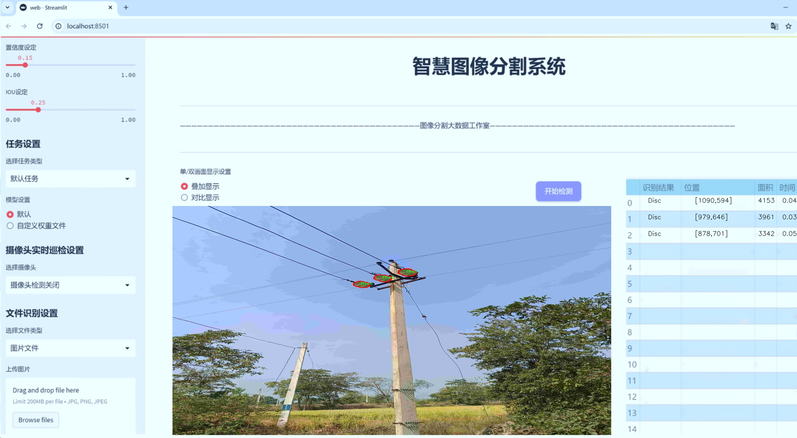
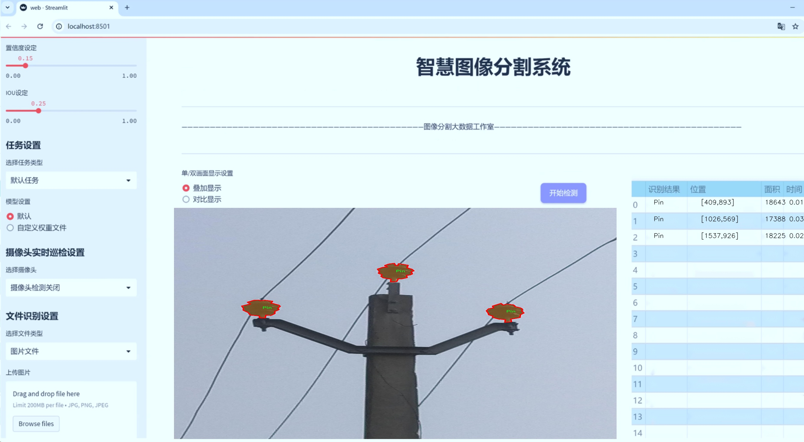
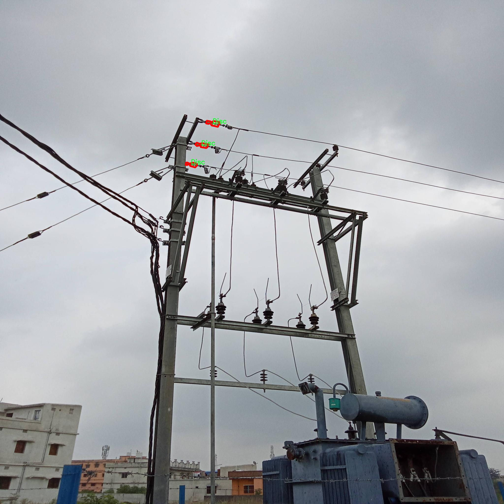
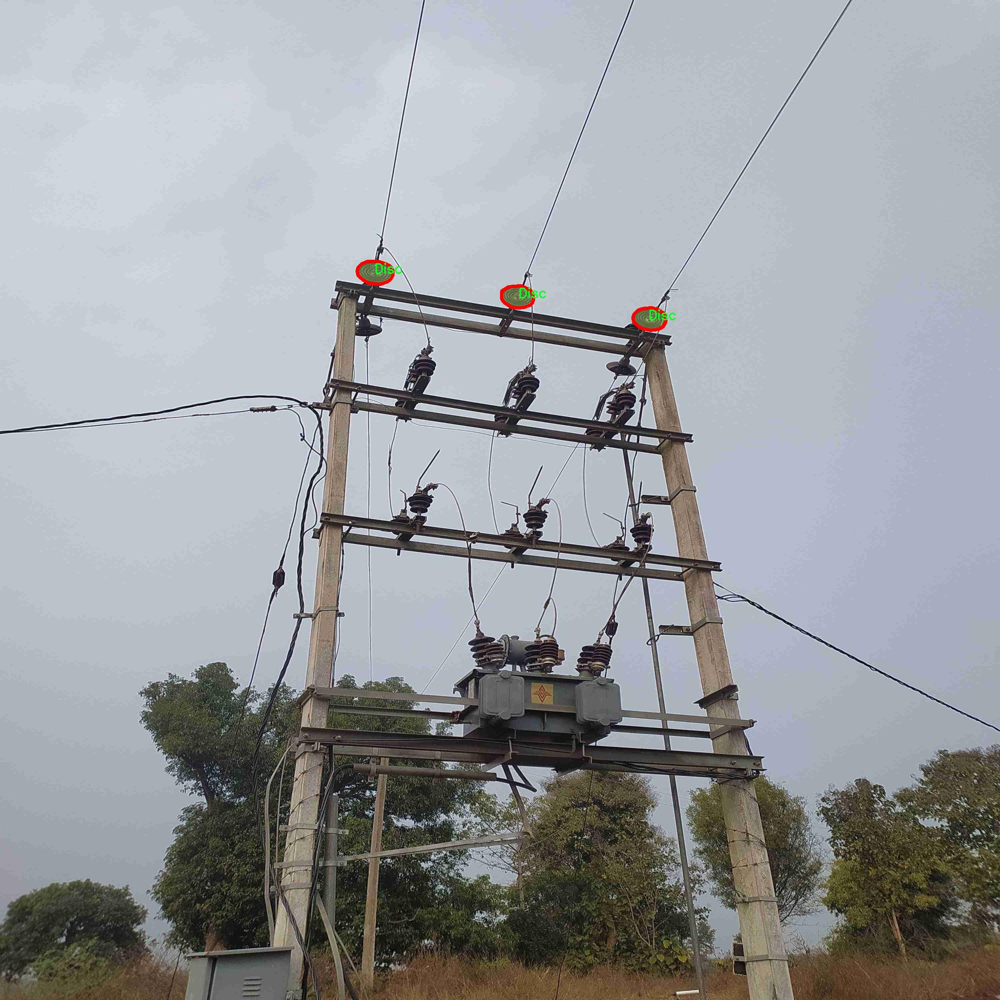
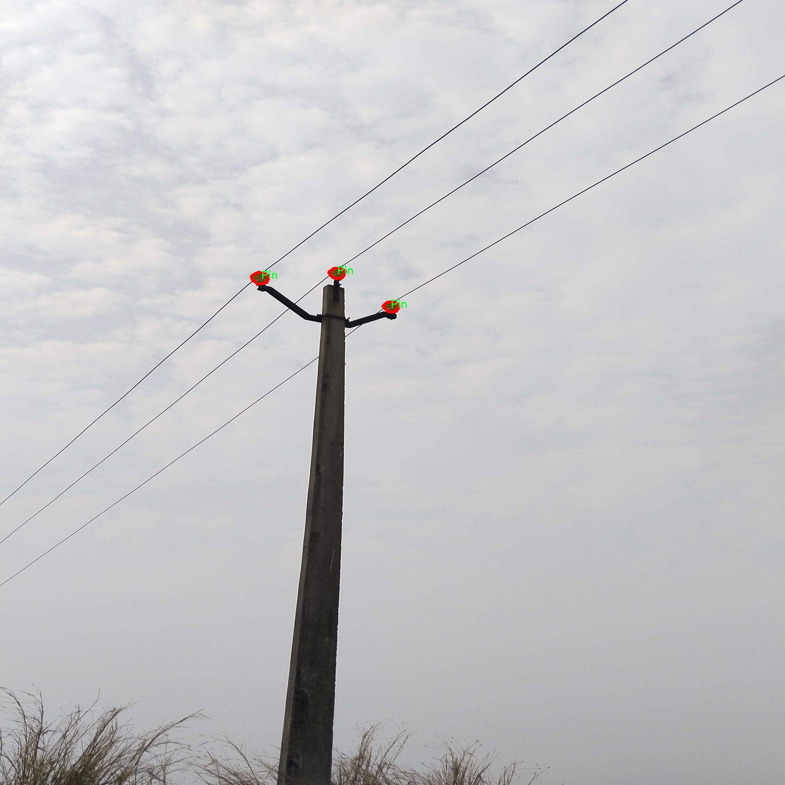
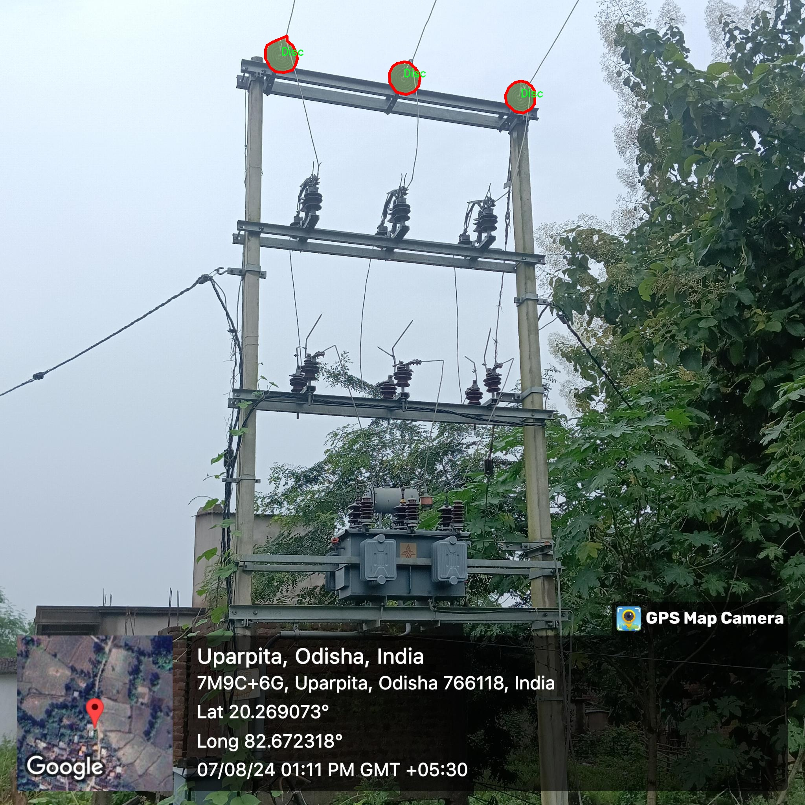
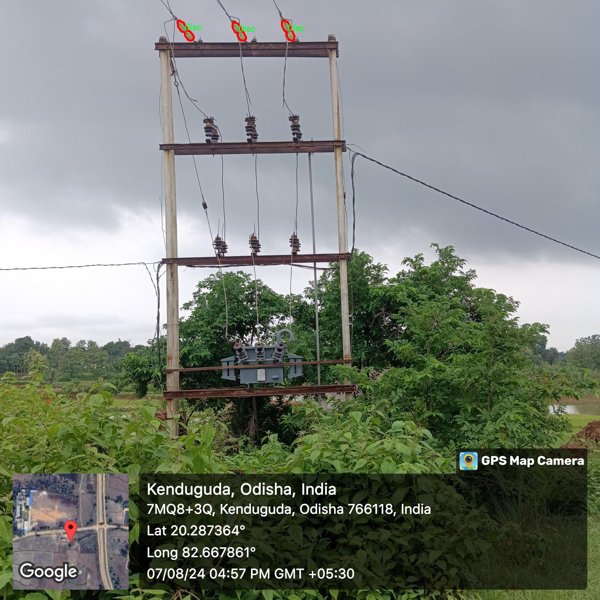

# 绝缘子类型分割系统： yolov8-seg-C2f-Faster

### 1.研究背景与意义

[参考博客](https://gitee.com/YOLOv8_YOLOv11_Segmentation_Studio/projects)

[博客来源](https://kdocs.cn/l/cszuIiCKVNis)

研究背景与意义

随着电力系统的不断发展与扩张，绝缘子作为电力设备中至关重要的组成部分，其性能直接影响到电力系统的安全性与稳定性。绝缘子的类型多样，包括盘形绝缘子和针形绝缘子等，具有不同的电气性能和适用场景。因此，准确识别和分类不同类型的绝缘子，对于电力设备的维护、故障诊断及预防性检修具有重要的实际意义。然而，传统的绝缘子检测方法多依赖人工目测，效率低下且容易受到人为因素的影响，难以满足现代电力系统对高效、准确检测的需求。

近年来，深度学习技术的迅猛发展为图像识别和分割领域带来了新的机遇。尤其是基于卷积神经网络（CNN）的目标检测算法，如YOLO（You Only Look Once）系列，因其实时性和高精度而受到广泛关注。YOLOv8作为该系列的最新版本，具备了更强的特征提取能力和更快的推理速度，能够在复杂背景下实现高效的目标检测与分割。因此，基于改进YOLOv8的绝缘子类型分割系统的研究，具有重要的理论价值和应用前景。

本研究的核心在于构建一个高效的绝缘子类型分割系统，利用YOLOv8的强大功能，对电力系统中的绝缘子进行精确的实例分割。数据集MV_Insulator_Type包含1100张图像，涵盖了两类绝缘子：盘形绝缘子和针形绝缘子。这一数据集的构建为模型的训练和验证提供了丰富的样本，能够有效提升模型的泛化能力与准确性。通过对该数据集的深入分析与处理，研究将探索如何优化YOLOv8的网络结构和训练策略，以适应绝缘子类型分割的特定需求。

此外，研究的意义还体现在其对电力行业的实际应用价值。通过实现自动化的绝缘子类型分割，能够大幅提升绝缘子检测的效率，降低人工成本，并提高检测的准确性。这不仅有助于及时发现绝缘子损坏或老化问题，确保电力系统的安全运行，还能为电力设备的维护决策提供数据支持，推动智能电网的发展。

综上所述，基于改进YOLOv8的绝缘子类型分割系统的研究，不仅在技术上具有创新性和前瞻性，同时在实际应用中也具有重要的社会和经济价值。通过这一研究，期望能够为电力行业提供一种高效、智能的解决方案，推动电力设备的智能化管理与维护，为实现更安全、更可靠的电力供应贡献力量。

### 2.图片演示







注意：本项目提供完整的训练源码数据集和训练教程,由于此博客编辑较早,暂不提供权重文件（best.pt）,需要按照6.训练教程进行训练后实现上图效果。

### 3.视频演示

[3.1 视频演示](https://www.bilibili.com/video/BV1dDUPYNEZa/)

### 4.数据集信息

##### 4.1 数据集类别数＆类别名

nc: 2
names: ['Disc', 'Pin']


##### 4.2 数据集信息简介

数据集信息展示

在本研究中，我们使用了名为“MV_Insulator_Type”的数据集，旨在改进YOLOv8-seg模型在绝缘子类型分割任务中的表现。该数据集专门为电力行业中的绝缘子分类而设计，具有重要的应用价值，尤其是在电力设备的维护和故障检测方面。数据集包含两种主要类别的绝缘子，分别为“Disc”（盘形绝缘子）和“Pin”（针形绝缘子），共计2个类别。这种分类方式不仅反映了绝缘子在实际应用中的多样性，也为模型的训练提供了明确的目标，使得模型能够在不同类型的绝缘子之间进行有效的区分。

“MV_Insulator_Type”数据集的构建过程经过精心设计，确保了数据的多样性和代表性。数据集中包含了大量的图像样本，这些样本在不同的环境条件下拍摄，涵盖了各种光照、角度和背景变化。这种多样性使得模型在训练过程中能够学习到更为丰富的特征，从而提高其在实际应用中的鲁棒性和准确性。此外，数据集中的图像均经过精确标注，确保了每个样本中绝缘子的类别信息和位置的准确性。这种高质量的标注对于模型的训练至关重要，因为它直接影响到模型的学习效果和最终的分割性能。

在进行模型训练时，我们将“MV_Insulator_Type”数据集分为训练集和验证集，以便于评估模型的泛化能力。训练集包含了大部分样本，用于模型的学习和参数调整，而验证集则用于定期评估模型的性能，确保模型在未见样本上的表现。通过这种方式，我们能够有效监控模型的训练过程，及时调整超参数，避免过拟合现象的发生。

在数据预处理阶段，我们对图像进行了多种增强操作，包括旋转、缩放、翻转和颜色调整等。这些操作不仅增加了数据集的有效样本数量，还帮助模型更好地适应不同的输入情况，提高了模型的泛化能力。通过这些预处理技术，我们期望模型能够在面对真实世界中的复杂情况时，依然保持高效的分割性能。

在实验过程中，我们将重点关注模型在“Disc”和“Pin”两类绝缘子上的分割精度和召回率。通过对比不同训练策略和模型架构的效果，我们将深入分析“MV_Insulator_Type”数据集对YOLOv8-seg模型性能的影响。最终，我们希望通过这一系列的实验，能够为电力行业提供一个高效、准确的绝缘子类型分割解决方案，从而提升设备的安全性和可靠性。

综上所述，“MV_Insulator_Type”数据集不仅为绝缘子类型分割任务提供了坚实的基础，也为后续的研究和应用奠定了良好的基础。通过充分利用这一数据集，我们期待在绝缘子检测和分类领域取得突破性进展，为电力设备的智能化管理贡献力量。











### 5.项目依赖环境部署教程（零基础手把手教学）

[5.1 环境部署教程链接（零基础手把手教学）](https://www.bilibili.com/video/BV1jG4Ve4E9t/?vd_source=bc9aec86d164b67a7004b996143742dc)


[5.2 安装Python虚拟环境创建和依赖库安装视频教程链接（零基础手把手教学）](https://www.bilibili.com/video/BV1nA4VeYEze/?vd_source=bc9aec86d164b67a7004b996143742dc)

### 6.手把手YOLOV8-seg训练视频教程（零基础手把手教学）

[6.1 手把手YOLOV8-seg训练视频教程（零基础小白有手就能学会）](https://www.bilibili.com/video/BV1cA4VeYETe/?vd_source=bc9aec86d164b67a7004b996143742dc)


按照上面的训练视频教程链接加载项目提供的数据集，运行train.py即可开始训练



     Epoch   gpu_mem       box       obj       cls    labels  img_size
     1/200     0G   0.01576   0.01955  0.007536        22      1280: 100%|██████████| 849/849 [14:42<00:00,  1.04s/it]
               Class     Images     Labels          P          R     mAP@.5 mAP@.5:.95: 100%|██████████| 213/213 [01:14<00:00,  2.87it/s]
                 all       3395      17314      0.994      0.957      0.0957      0.0843

     Epoch   gpu_mem       box       obj       cls    labels  img_size
     2/200     0G   0.01578   0.01923  0.007006        22      1280: 100%|██████████| 849/849 [14:44<00:00,  1.04s/it]
               Class     Images     Labels          P          R     mAP@.5 mAP@.5:.95: 100%|██████████| 213/213 [01:12<00:00,  2.95it/s]
                 all       3395      17314      0.996      0.956      0.0957      0.0845

     Epoch   gpu_mem       box       obj       cls    labels  img_size
     3/200     0G   0.01561    0.0191  0.006895        27      1280: 100%|██████████| 849/849 [10:56<00:00,  1.29it/s]
               Class     Images     Labels          P          R     mAP@.5 mAP@.5:.95: 100%|███████   | 187/213 [00:52<00:00,  4.04it/s]
                 all       3395      17314      0.996      0.957      0.0957      0.0845


### 7.50+种全套YOLOV8-seg创新点加载调参实验视频教程（一键加载写好的改进模型的配置文件）

[7.1 50+种全套YOLOV8-seg创新点加载调参实验视频教程（一键加载写好的改进模型的配置文件）](https://www.bilibili.com/video/BV1Hw4VePEXv/?vd_source=bc9aec86d164b67a7004b996143742dc)

### YOLOV8-seg算法简介

原始YOLOv8-seg算法原理

YOLOv8-seg算法是2023年由Ultralytics推出的YOLO系列中的最新版本，代表了目标检测和实例分割领域的一次重要进步。该算法不仅继承了YOLO系列以往的优良传统，还在多个方面进行了创新和优化，尤其是在模型结构、损失函数和特征融合等方面的改进，使其在精度和速度上都达到了新的高度。

YOLOv8的架构可以分为四个主要部分：输入端、骨干网络、颈部网络和头部网络。输入端采用了马赛克数据增强、自适应锚框计算和自适应灰度填充等技术，以增强模型的鲁棒性和适应性。马赛克数据增强通过将多张图像拼接在一起，生成新的训练样本，帮助模型更好地学习不同场景下的特征。自适应锚框计算则通过动态调整锚框的大小和形状，使得模型能够更好地适应不同尺寸和形状的目标。

在骨干网络部分，YOLOv8引入了C2f模块和SPPF（Spatial Pyramid Pooling Fusion）结构。C2f模块通过增加跨层连接的分支，增强了梯度流动性，从而提高了特征学习的能力。这种设计使得YOLOv8在处理复杂场景时，能够更有效地提取和融合多层次的特征信息。SPPF结构则通过空间金字塔池化的方式，增强了模型对不同尺度目标的识别能力，使得YOLOv8在处理小目标和大目标时都表现出色。

颈部网络采用了路径聚合网络（PAN）结构，进一步提升了不同尺度特征的融合能力。PAN通过有效地整合来自不同层次的特征图，确保了模型在进行目标检测时能够充分利用上下文信息。这种特征融合的方式使得YOLOv8在复杂背景下的目标检测精度得到了显著提升。

头部网络是YOLOv8的核心部分，负责分类和检测的解耦。与以往的耦合头设计不同，YOLOv8采用了解耦头结构，将分类和回归任务分开处理。这种设计不仅简化了模型的结构，还提高了训练效率和检测精度。YOLOv8在头部网络中引入了新的损失计算策略，采用Task-Aligned Assigner分配正负样本，通过分类与回归的分数加权结果选择正样本，从而优化了模型的学习过程。损失计算涵盖了分类和回归两个分支，其中分类分支使用二元交叉熵损失（BCELoss），而回归分支则结合了分布焦点损失（DFLoss）和完全交并比损失函数（CIOULoss），以提升模型对边界框预测的精准性。

YOLOv8的创新之处不仅体现在结构设计上，还包括了新的Anchor-Free检测头的引入。这一变化使得YOLOv8在目标检测时不再依赖于传统的锚框预测，减少了计算复杂度，同时加速了非最大抑制（NMS）过程。这种无锚框检测的方式使得YOLOv8在处理复杂场景时更加灵活，能够更快地适应不同的目标特征。

在性能方面，YOLOv8相较于前代版本有了显著提升。通过对卷积层的kernel大小进行调整、优化C2f模块的结构以及精简模型通道数，YOLOv8在保持高精度的同时，实现了更快的检测速度。这种高效的性能使得YOLOv8在实时目标检测和实例分割任务中具备了更强的竞争力。

总的来说，YOLOv8-seg算法通过对网络结构的创新和损失函数的优化，达到了目标检测和实例分割领域的前沿水平。其在苹果采摘等实际应用中的表现，充分展现了YOLOv8在视觉识别和自动化作业中的巨大潜力。随着YOLOv8的推广和应用，目标检测领域将迎来新的发展机遇，推动相关技术的不断进步。


### 9.系统功能展示（检测对象为举例，实际内容以本项目数据集为准）

图9.1.系统支持检测结果表格显示

  图9.2.系统支持置信度和IOU阈值手动调节

  图9.3.系统支持自定义加载权重文件best.pt(需要你通过步骤5中训练获得)

  图9.4.系统支持摄像头实时识别

  图9.5.系统支持图片识别

  图9.6.系统支持视频识别

  图9.7.系统支持识别结果文件自动保存

  图9.8.系统支持Excel导出检测结果数据


### 10.50+种全套YOLOV8-seg创新点原理讲解（非科班也可以轻松写刊发刊，V11版本正在科研待更新）

#### 10.1 由于篇幅限制，每个创新点的具体原理讲解就不一一展开，具体见下列网址中的创新点对应子项目的技术原理博客网址【Blog】：


[10.1 50+种全套YOLOV8-seg创新点原理讲解链接](https://gitee.com/qunmasj/good)

#### 10.2 部分改进模块原理讲解(完整的改进原理见上图和技术博客链接)【如果此小节的图加载失败可以通过CSDN或者Github搜索该博客的标题访问原始博客，原始博客图片显示正常】

### YOLOv8简介
YoloV8模型结构
YOLOv3之前的所有YOLO对象检测模型都是用C语言编写的，并使用了Darknet框架，Ultralytics发布了第一个使用PyTorch框架实现的YOLO (YOLOv3)；YOLOv3之后，Ultralytics发布了YOLOv5，在2023年1月，Ultralytics发布了YOLOv8，包含五个模型，用于检测、分割和分类。 YOLOv8 Nano是其中最快和最小的，而YOLOv8 Extra Large (YOLOv8x)是其中最准确但最慢的，具体模型见后续的图。

YOLOv8附带以下预训练模型:

目标检测在图像分辨率为640的COCO检测数据集上进行训练。
实例分割在图像分辨率为640的COCO分割数据集上训练。
图像分类模型在ImageNet数据集上预训练，图像分辨率为224。
YOLOv8 概述
具体到 YOLOv8 算法，其核心特性和改动可以归结为如下：

提供了一个全新的SOTA模型（state-of-the-art model），包括 P5 640 和 P6 1280 分辨率的目标检测网络和基于YOLACT的实例分割模型。和 YOLOv5 一样，基于缩放系数也提供了 N/S/M/L/X 尺度的不同大小模型，用于满足不同场景需求
骨干网络和 Neck 部分可能参考了 YOLOv7 ELAN 设计思想，将 YOLOv5 的 C3 结构换成了梯度流更丰富的 C2f 结构，并对不同尺度模型调整了不同的通道数，属于对模型结构精心微调，不再是一套参数应用所有模型，大幅提升了模型性能。
Head 部分相比 YOLOv5 改动较大，换成了目前主流的解耦头结构，将分类和检测头分离，同时也从Anchor-Based 换成了 Anchor-Free
Loss 计算方面采用了TaskAlignedAssigner正样本分配策略，并引入了Distribution Focal Loss
训练的数据增强部分引入了 YOLOX 中的最后 10 epoch 关闭 Mosiac 增强的操作，可以有效地提升精度


### HRNet V2简介
现在设计高低分辨率融合的思路主要有以下四种：


（a）对称结构。如U-Net、Hourglass等，都是先下采样再上采样，上下采样过程对称。

（b）级联金字塔。如refinenet等，高低分辨率融合时经过卷积处理。

（c）简单的baseline，用转职卷积进行上采样。

（d）扩张卷积。如deeplab等，增大感受野，减少下采样次数，可以无需跳层连接直接进行上采样。

（b）（c）都是使用复杂一些的网络进行下采样（如resnet、vgg），再用轻量级的网络进行上采样。

HRNet V1是在（b）的基础上进行改进，从头到尾保持大的分辨率表示。然而HRNet V1仅是用在姿态估计领域的，HRNet V2对它做小小的改进可以使其适用于更广的视觉任务。这一改进仅仅增加了较小的计算开销，但却提升了较大的准确度。

#### 网络结构图：


这个结构图简洁明了就不多介绍了，首先图2的输入是已经经过下采样四倍的feature map，横向的conv block指的是basicblock 或 bottleblock，不同分辨率之间的多交叉线部分是multi-resolution convolution（多分辨率组卷积）。

到此为止HRNet V2和HRNet V1是完全一致的。

区别之处在于这个基网络上加的一个head：


图3介绍的是接在图2最后的head。（a）是HRNet V1的头，很明显他只用了大分辨率的特征图。（b）（c）是HRNet V2的创新点，（b）用与语义分割，（c）用于目标检测。除此之外作者还在实验部分介绍了用于分类的head，如图4所示。


#### 多分辨率block：


一个多分辨率block由多分辨率组卷积（a）和多分辨率卷积（b）组成。（c）是一个正常卷积的展开，（b）的灵感来源于（c）。代码中（a）部分由Bottleneck和BasicBlock组成。

多分辨率卷积和正常卷积的区别：（1）多分辨率卷积中，每个通道的subset的分辨率都不一样。（2）通道之间的连接如果是降分辨率，则用的是3x3的2stride的卷积，如果是升分辨率，用的是双线性最邻近插值上采样。


### 11.项目核心源码讲解（再也不用担心看不懂代码逻辑）

#### 11.1 ultralytics\nn\backbone\SwinTransformer.py

以下是经过精简和注释的核心代码，保留了Swin Transformer的主要结构和功能。

```python
import torch
import torch.nn as nn
import torch.nn.functional as F
import numpy as np
from timm.models.layers import DropPath, to_2tuple, trunc_normal_

class Mlp(nn.Module):
    """多层感知机（MLP）模块"""
    def __init__(self, in_features, hidden_features=None, out_features=None, act_layer=nn.GELU, drop=0.):
        super().__init__()
        out_features = out_features or in_features  # 输出特征数
        hidden_features = hidden_features or in_features  # 隐藏层特征数
        self.fc1 = nn.Linear(in_features, hidden_features)  # 第一层线性变换
        self.act = act_layer()  # 激活函数
        self.fc2 = nn.Linear(hidden_features, out_features)  # 第二层线性变换
        self.drop = nn.Dropout(drop)  # Dropout层

    def forward(self, x):
        """前向传播"""
        x = self.fc1(x)
        x = self.act(x)
        x = self.drop(x)
        x = self.fc2(x)
        x = self.drop(x)
        return x

def window_partition(x, window_size):
    """将输入张量分割成窗口"""
    B, H, W, C = x.shape
    x = x.view(B, H // window_size, window_size, W // window_size, window_size, C)
    windows = x.permute(0, 1, 3, 2, 4, 5).contiguous().view(-1, window_size, window_size, C)
    return windows

def window_reverse(windows, window_size, H, W):
    """将窗口合并回原始张量"""
    B = int(windows.shape[0] / (H * W / window_size / window_size))
    x = windows.view(B, H // window_size, W // window_size, window_size, window_size, -1)
    x = x.permute(0, 1, 3, 2, 4, 5).contiguous().view(B, H, W, -1)
    return x

class WindowAttention(nn.Module):
    """窗口注意力机制"""
    def __init__(self, dim, window_size, num_heads, qkv_bias=True, attn_drop=0., proj_drop=0.):
        super().__init__()
        self.dim = dim
        self.window_size = window_size
        self.num_heads = num_heads
        head_dim = dim // num_heads
        self.scale = head_dim ** -0.5  # 缩放因子

        # 相对位置偏置表
        self.relative_position_bias_table = nn.Parameter(
            torch.zeros((2 * window_size[0] - 1) * (2 * window_size[1] - 1), num_heads))

        # 计算相对位置索引
        coords_h = torch.arange(self.window_size[0])
        coords_w = torch.arange(self.window_size[1])
        coords = torch.stack(torch.meshgrid([coords_h, coords_w]))
        coords_flatten = torch.flatten(coords, 1)
        relative_coords = coords_flatten[:, :, None] - coords_flatten[:, None, :]
        relative_coords = relative_coords.permute(1, 2, 0).contiguous()
        relative_coords[:, :, 0] += self.window_size[0] - 1
        relative_coords[:, :, 1] += self.window_size[1] - 1
        relative_coords[:, :, 0] *= 2 * self.window_size[1] - 1
        self.relative_position_index = relative_coords.sum(-1)

        self.qkv = nn.Linear(dim, dim * 3, bias=qkv_bias)  # 线性变换生成Q、K、V
        self.attn_drop = nn.Dropout(attn_drop)
        self.proj = nn.Linear(dim, dim)  # 输出线性变换
        self.proj_drop = nn.Dropout(proj_drop)
        trunc_normal_(self.relative_position_bias_table, std=.02)  # 初始化相对位置偏置
        self.softmax = nn.Softmax(dim=-1)

    def forward(self, x, mask=None):
        """前向传播"""
        B_, N, C = x.shape
        qkv = self.qkv(x).reshape(B_, N, 3, self.num_heads, C // self.num_heads).permute(2, 0, 3, 1, 4)
        q, k, v = qkv[0], qkv[1], qkv[2]

        q = q * self.scale  # 缩放Q
        attn = (q @ k.transpose(-2, -1))  # 计算注意力分数

        # 添加相对位置偏置
        relative_position_bias = self.relative_position_bias_table[self.relative_position_index.view(-1)].view(
            self.window_size[0] * self.window_size[1], self.window_size[0] * self.window_size[1], -1)
        relative_position_bias = relative_position_bias.permute(2, 0, 1).contiguous()
        attn = attn + relative_position_bias.unsqueeze(0)

        attn = self.softmax(attn)  # 归一化
        attn = self.attn_drop(attn)

        x = (attn @ v).transpose(1, 2).reshape(B_, N, C)  # 计算输出
        x = self.proj(x)
        x = self.proj_drop(x)
        return x

class SwinTransformerBlock(nn.Module):
    """Swin Transformer基本块"""
    def __init__(self, dim, num_heads, window_size=7, shift_size=0, mlp_ratio=4., drop=0., attn_drop=0.):
        super().__init__()
        self.dim = dim
        self.num_heads = num_heads
        self.window_size = window_size
        self.shift_size = shift_size
        self.mlp_ratio = mlp_ratio

        self.norm1 = nn.LayerNorm(dim)  # 归一化层
        self.attn = WindowAttention(dim, window_size=to_2tuple(self.window_size), num_heads=num_heads,
                                    attn_drop=attn_drop)

        self.drop_path = DropPath(drop) if drop > 0. else nn.Identity()  # 随机深度
        self.norm2 = nn.LayerNorm(dim)
        mlp_hidden_dim = int(dim * mlp_ratio)
        self.mlp = Mlp(in_features=dim, hidden_features=mlp_hidden_dim, drop=drop)

    def forward(self, x, mask_matrix):
        """前向传播"""
        shortcut = x
        x = self.norm1(x)
        B, L, C = x.shape
        x = x.view(B, int(L**0.5), int(L**0.5), C)  # 变形为H*W格式

        # 窗口分割
        x_windows = window_partition(x, self.window_size)
        attn_windows = self.attn(x_windows, mask=mask_matrix)  # 计算窗口注意力

        # 合并窗口
        x = window_reverse(attn_windows, self.window_size, int(L**0.5), int(L**0.5))
        x = shortcut + self.drop_path(x)  # 残差连接
        x = x + self.drop_path(self.mlp(self.norm2(x)))  # MLP层
        return x

class SwinTransformer(nn.Module):
    """Swin Transformer主模型"""
    def __init__(self, depths=[2, 2, 6, 2], num_heads=[3, 6, 12, 24], embed_dim=96):
        super().__init__()
        self.layers = nn.ModuleList()
        for i_layer in range(len(depths)):
            layer = SwinTransformerBlock(
                dim=int(embed_dim * 2 ** i_layer),
                num_heads=num_heads[i_layer],
                window_size=7,
                drop=0.,
                attn_drop=0.)
            self.layers.append(layer)

    def forward(self, x):
        """前向传播"""
        for layer in self.layers:
            x = layer(x, None)  # 这里mask_matrix为None
        return x

def SwinTransformer_Tiny(weights=''):
    """构建Swin Transformer Tiny模型"""
    model = SwinTransformer(depths=[2, 2, 6, 2], num_heads=[3, 6, 12, 24])
    if weights:
        model.load_state_dict(torch.load(weights)['model'])
    return model
```

### 代码注释说明
1. **Mlp类**：实现了一个简单的多层感知机，包括两个线性层和一个激活函数，支持Dropout。
2. **window_partition和window_reverse函数**：用于将输入张量分割成多个窗口和将窗口合并回原始形状。
3. **WindowAttention类**：实现了窗口注意力机制，支持相对位置偏置。
4. **SwinTransformerBlock类**：构建了Swin Transformer的基本块，包含注意力层和MLP层，使用残差连接。
5. **SwinTransformer类**：构建了整个Swin Transformer模型，包含多个Swin Transformer块。
6. **SwinTransformer_Tiny函数**：用于创建一个小型的Swin Transformer模型，并可加载预训练权重。

以上代码保留了Swin Transformer的核心结构，去除了冗余部分，并进行了详细的中文注释。

这个文件实现了Swin Transformer模型的结构，Swin Transformer是一种基于视觉的Transformer架构，主要用于图像处理任务。文件中包含多个类和函数，下面对其进行逐一分析。

首先，文件导入了必要的库，包括PyTorch的核心模块、功能模块和一些辅助函数。接着，定义了一个名为`Mlp`的类，这是一个多层感知机（MLP），包含两个线性层和一个激活函数（默认为GELU），以及一个可选的Dropout层。`forward`方法定义了前向传播的过程。

接下来，定义了两个辅助函数`window_partition`和`window_reverse`，它们用于将输入张量分割成窗口（patches）和将窗口合并回原始形状。这在Swin Transformer中非常重要，因为该模型采用了局部窗口注意力机制。

`WindowAttention`类实现了窗口基础的多头自注意力机制（W-MSA），支持相对位置偏置。它通过计算查询、键、值的线性变换来生成注意力权重，并在此基础上应用相对位置偏置。`forward`方法中，输入特征经过注意力计算后返回。

`SwinTransformerBlock`类是Swin Transformer的基本构建块，包含了一个窗口注意力层和一个MLP层。它支持循环移位操作，以实现跨窗口的注意力计算。`forward`方法中，输入特征经过归一化、窗口分割、注意力计算、窗口合并和MLP处理，最终返回结果。

`PatchMerging`类用于将特征图的补丁合并，减少空间维度并增加通道数。它通过线性层实现合并，并在合并前进行归一化。

`BasicLayer`类代表Swin Transformer中的一个基本层，包含多个Swin Transformer块。它计算注意力掩码，并在每个块中进行前向传播。该类还可以选择性地进行下采样。

`PatchEmbed`类负责将输入图像划分为补丁并进行嵌入。它使用卷积层进行线性投影，并可选地进行归一化。

`SwinTransformer`类是整个模型的核心，负责构建和组织不同的层。它初始化了补丁嵌入、位置嵌入、各层的构建，并在前向传播中依次通过各层进行处理，最终返回指定层的输出。

最后，`update_weight`函数用于更新模型的权重，确保模型字典中的权重与加载的权重字典匹配。`SwinTransformer_Tiny`函数则是一个便捷的构造函数，用于创建一个小型的Swin Transformer模型，并可选择加载预训练权重。

整体来看，这个文件实现了Swin Transformer的完整结构，涵盖了从输入处理到特征提取的各个环节，适用于图像分类、目标检测等视觉任务。

#### 11.2 ultralytics\utils\dist.py

以下是经过简化和注释的核心代码部分：

```python
import os
import re
import shutil
import socket
import sys
import tempfile
from pathlib import Path

from . import USER_CONFIG_DIR
from .torch_utils import TORCH_1_9

def find_free_network_port() -> int:
    """
    查找本地主机上可用的网络端口。

    在单节点训练时，当我们不想连接到真实的主节点但必须设置
    `MASTER_PORT` 环境变量时，这个函数非常有用。
    """
    with socket.socket(socket.AF_INET, socket.SOCK_STREAM) as s:
        s.bind(('127.0.0.1', 0))  # 绑定到本地地址和随机端口
        return s.getsockname()[1]  # 返回分配的端口号

def generate_ddp_file(trainer):
    """生成 DDP 文件并返回其文件名。"""
    # 获取训练器的模块和类名
    module, name = f'{trainer.__class__.__module__}.{trainer.__class__.__name__}'.rsplit('.', 1)

    # 构建文件内容
    content = f'''overrides = {vars(trainer.args)} \nif __name__ == "__main__":
    from {module} import {name}
    from ultralytics.utils import DEFAULT_CFG_DICT

    cfg = DEFAULT_CFG_DICT.copy()
    cfg.update(save_dir='')   # 处理额外的 'save_dir' 键
    trainer = {name}(cfg=cfg, overrides=overrides)
    trainer.train()'''
    
    # 创建 DDP 目录（如果不存在）
    (USER_CONFIG_DIR / 'DDP').mkdir(exist_ok=True)
    
    # 创建临时文件并写入内容
    with tempfile.NamedTemporaryFile(prefix='_temp_',
                                     suffix=f'{id(trainer)}.py',
                                     mode='w+',
                                     encoding='utf-8',
                                     dir=USER_CONFIG_DIR / 'DDP',
                                     delete=False) as file:
        file.write(content)  # 写入内容到临时文件
    return file.name  # 返回临时文件名

def generate_ddp_command(world_size, trainer):
    """生成并返回用于分布式训练的命令。"""
    import __main__  # 本地导入以避免某些问题
    if not trainer.resume:
        shutil.rmtree(trainer.save_dir)  # 删除保存目录
    
    # 获取当前脚本的绝对路径
    file = str(Path(sys.argv[0]).resolve())
    
    # 定义安全的文件名模式
    safe_pattern = re.compile(r'^[a-zA-Z0-9_. /\\-]{1,128}$')
    
    # 检查文件名是否安全，若不安全则生成 DDP 文件
    if not (safe_pattern.match(file) and Path(file).exists() and file.endswith('.py')):
        file = generate_ddp_file(trainer)
    
    # 根据 PyTorch 版本选择分布式命令
    dist_cmd = 'torch.distributed.run' if TORCH_1_9 else 'torch.distributed.launch'
    
    # 查找可用的网络端口
    port = find_free_network_port()
    
    # 构建命令
    cmd = [sys.executable, '-m', dist_cmd, '--nproc_per_node', f'{world_size}', '--master_port', f'{port}', file]
    return cmd, file  # 返回命令和文件名

def ddp_cleanup(trainer, file):
    """如果创建了临时文件，则删除它。"""
    if f'{id(trainer)}.py' in file:  # 检查文件名是否包含临时文件后缀
        os.remove(file)  # 删除临时文件
```

### 代码说明：
1. **查找可用端口**：`find_free_network_port` 函数用于查找本地主机上可用的网络端口，主要用于分布式训练时设置 `MASTER_PORT` 环境变量。
2. **生成 DDP 文件**：`generate_ddp_file` 函数生成一个临时 Python 文件，包含训练器的配置信息和训练逻辑。
3. **生成分布式训练命令**：`generate_ddp_command` 函数构建分布式训练的命令，检查当前脚本的安全性，并在必要时生成 DDP 文件。
4. **清理临时文件**：`ddp_cleanup` 函数用于删除在训练过程中生成的临时文件，以避免不必要的文件残留。

这个程序文件 `ultralytics/utils/dist.py` 主要用于处理分布式训练中的一些功能，特别是在使用 PyTorch 进行训练时。文件中包含了几个重要的函数，每个函数都有其特定的用途。

首先，`find_free_network_port` 函数用于查找本地主机上一个可用的网络端口。这个功能在单节点训练时非常有用，因为我们不想连接到一个真实的主节点，但仍然需要设置 `MASTER_PORT` 环境变量。该函数通过创建一个 TCP 套接字并绑定到本地地址，返回一个可用的端口号。

接下来，`generate_ddp_file` 函数用于生成一个 DDP（Distributed Data Parallel）文件，并返回该文件的名称。这个函数首先获取训练器的类模块和名称，然后构建一个包含训练参数的 Python 脚本内容。它会在用户配置目录下创建一个名为 `DDP` 的文件夹（如果不存在的话），并将生成的脚本内容写入一个临时文件中。这个临时文件的命名方式是以 `_temp_` 为前缀，后面跟着训练器的 ID，以确保文件名的唯一性。

然后是 `generate_ddp_command` 函数，它生成并返回用于分布式训练的命令。该函数首先检查训练器是否需要恢复训练，如果不需要，则删除保存目录。接着，它会检查当前执行的文件是否符合安全模式（即文件名只能包含特定字符且存在且以 `.py` 结尾）。如果不符合条件，则调用 `generate_ddp_file` 生成一个新的 DDP 文件。之后，函数会根据 PyTorch 的版本选择合适的分布式运行命令，并查找一个可用的网络端口。最终，它构建一个命令列表，其中包含 Python 解释器、分布式命令、进程数和文件名等信息。

最后，`ddp_cleanup` 函数用于清理临时文件。如果生成的临时文件的后缀与训练器的 ID 匹配，该函数会删除这个临时文件，以避免在训练结束后留下不必要的文件。

总体来说，这个文件的功能主要集中在支持分布式训练的环境设置和临时文件管理上，为 Ultralytics YOLO 提供了必要的工具以便于进行高效的模型训练。

#### 11.3 ultralytics\utils\callbacks\wb.py

以下是代码中最核心的部分，并附上详细的中文注释：

```python
# 导入必要的库
from ultralytics.utils import SETTINGS, TESTS_RUNNING
from ultralytics.utils.torch_utils import model_info_for_loggers

try:
    # 确保当前不是在运行测试
    assert not TESTS_RUNNING  
    # 确保WandB集成已启用
    assert SETTINGS['wandb'] is True  
    import wandb as wb  # 导入WandB库

    # 确保WandB库的版本有效
    assert hasattr(wb, '__version__')  

    import numpy as np  # 导入NumPy库
    import pandas as pd  # 导入Pandas库

    _processed_plots = {}  # 用于存储已处理的图表信息

except (ImportError, AssertionError):
    wb = None  # 如果导入失败或断言失败，则将wb设置为None


def _custom_table(x, y, classes, title='Precision Recall Curve', x_title='Recall', y_title='Precision'):
    """
    创建并记录自定义的精确度-召回率曲线可视化。

    Args:
        x (List): x轴的值，长度为N。
        y (List): y轴的值，长度为N。
        classes (List): 每个点的类别标签，长度为N。
        title (str, optional): 图表标题，默认为'Precision Recall Curve'。
        x_title (str, optional): x轴标签，默认为'Recall'。
        y_title (str, optional): y轴标签，默认为'Precision'。

    Returns:
        (wandb.Object): 适合记录的WandB对象，展示自定义的度量可视化。
    """
    # 创建一个DataFrame用于存储数据
    df = pd.DataFrame({'class': classes, 'y': y, 'x': x}).round(3)
    fields = {'x': 'x', 'y': 'y', 'class': 'class'}
    string_fields = {'title': title, 'x-axis-title': x_title, 'y-axis-title': y_title}
    
    # 返回WandB的表格对象
    return wb.plot_table('wandb/area-under-curve/v0',
                         wb.Table(dataframe=df),
                         fields=fields,
                         string_fields=string_fields)


def _plot_curve(x, y, names=None, id='precision-recall', title='Precision Recall Curve', x_title='Recall', y_title='Precision', num_x=100, only_mean=False):
    """
    记录度量曲线可视化。

    Args:
        x (np.ndarray): x轴的数据点，长度为N。
        y (np.ndarray): y轴的数据点，形状为CxN，C为类别数量。
        names (list, optional): y轴数据对应的类别名称，长度为C。
        id (str, optional): 在WandB中记录数据的唯一标识符，默认为'precision-recall'。
        title (str, optional): 可视化图表的标题，默认为'Precision Recall Curve'。
        x_title (str, optional): x轴的标签，默认为'Recall'。
        y_title (str, optional): y轴的标签，默认为'Precision'。
        num_x (int, optional): 可视化的插值数据点数量，默认为100。
        only_mean (bool, optional): 标志，指示是否仅绘制均值曲线，默认为False。

    Note:
        该函数利用'_custom_table'函数生成实际的可视化。
    """
    # 创建新的x值
    if names is None:
        names = []
    x_new = np.linspace(x[0], x[-1], num_x).round(5)

    # 创建用于记录的数组
    x_log = x_new.tolist()
    y_log = np.interp(x_new, x, np.mean(y, axis=0)).round(3).tolist()

    if only_mean:
        # 如果仅绘制均值曲线
        table = wb.Table(data=list(zip(x_log, y_log)), columns=[x_title, y_title])
        wb.run.log({title: wb.plot.line(table, x_title, y_title, title=title)})
    else:
        # 如果绘制所有类别的曲线
        classes = ['mean'] * len(x_log)
        for i, yi in enumerate(y):
            x_log.extend(x_new)  # 添加新的x值
            y_log.extend(np.interp(x_new, x, yi))  # 将y插值到新的x
            classes.extend([names[i]] * len(x_new))  # 添加类别名称
        wb.log({id: _custom_table(x_log, y_log, classes, title, x_title, y_title)}, commit=False)


def on_fit_epoch_end(trainer):
    """在每个训练周期结束时记录训练指标和模型信息。"""
    wb.run.log(trainer.metrics, step=trainer.epoch + 1)  # 记录训练指标
    _log_plots(trainer.plots, step=trainer.epoch + 1)  # 记录训练图表
    _log_plots(trainer.validator.plots, step=trainer.epoch + 1)  # 记录验证图表
    if trainer.epoch == 0:
        wb.run.log(model_info_for_loggers(trainer), step=trainer.epoch + 1)  # 记录模型信息


def on_train_end(trainer):
    """在训练结束时保存最佳模型作为工件。"""
    _log_plots(trainer.validator.plots, step=trainer.epoch + 1)  # 记录验证图表
    _log_plots(trainer.plots, step=trainer.epoch + 1)  # 记录训练图表
    art = wb.Artifact(type='model', name=f'run_{wb.run.id}_model')  # 创建模型工件
    if trainer.best.exists():
        art.add_file(trainer.best)  # 添加最佳模型文件
        wb.run.log_artifact(art, aliases=['best'])  # 记录工件
    wb.run.finish()  # 结束WandB运行
```

### 代码核心部分解释：
1. **导入和初始化**：导入必要的库并进行一些初始化检查，确保WandB集成正常。
2. **自定义表格和曲线绘制**：定义了 `_custom_table` 和 `_plot_curve` 函数，用于创建和记录精确度-召回率曲线的可视化。
3. **训练过程中的回调**：定义了 `on_fit_epoch_end` 和 `on_train_end` 函数，分别在每个训练周期结束时记录指标和在训练结束时保存最佳模型。

这个程序文件是一个用于集成WandB（Weights and Biases）工具的回调模块，主要用于在训练YOLO模型时记录和可视化训练过程中的各种指标和图表。文件的开头部分导入了一些必要的库和模块，并进行了一些基本的检查，以确保WandB库的可用性和配置的正确性。

在程序中，定义了几个主要的函数。首先是`_custom_table`函数，它用于创建和记录一个自定义的精确度-召回曲线（Precision-Recall Curve）可视化。这个函数接收x轴和y轴的数据，以及类标签，生成一个适合WandB记录的表格对象，便于后续的可视化展示。

接下来是`_plot_curve`函数，它用于生成和记录一个指标曲线的可视化。这个函数根据输入的数据生成一个新的x轴数据，并通过插值方法计算y轴数据。根据`only_mean`参数的不同，函数可以选择只绘制平均曲线或绘制每个类的曲线。生成的曲线通过调用`_custom_table`函数进行记录。

`_log_plots`函数用于记录输入字典中的图表，如果在指定的步骤中尚未记录过该图表，则进行记录。这个函数通过检查已处理的图表来避免重复记录。

接下来的几个函数分别在不同的训练阶段被调用，以记录相应的指标和图表。例如，`on_pretrain_routine_start`函数在预训练开始时初始化WandB项目，`on_fit_epoch_end`函数在每个训练周期结束时记录训练指标和模型信息，`on_train_epoch_end`函数在每个训练周期结束时记录损失和学习率，并在特定周期记录图表，`on_train_end`函数则在训练结束时保存最佳模型并记录验证指标的曲线。

最后，程序将这些回调函数组织成一个字典，方便在训练过程中调用。整个模块的设计旨在增强模型训练过程中的可视化和监控，帮助开发者更好地理解和优化模型的性能。

#### 11.4 ultralytics\nn\extra_modules\ops_dcnv3\test.py

以下是代码中最核心的部分，并附上详细的中文注释：

```python
import torch
from functions.dcnv3_func import DCNv3Function, dcnv3_core_pytorch

# 输入图像的高度和宽度
H_in, W_in = 8, 8
# 批量大小、输出通道数和输入通道数
N, M, D = 2, 4, 16
# 卷积核的高度和宽度
Kh, Kw = 3, 3
# 是否移除中心点
remove_center = False
# 卷积核的有效点数
P = Kh * Kw - remove_center
# 偏移缩放因子
offset_scale = 2.0
# 填充、扩张和步幅
pad = 1
dilation = 1
stride = 1
# 输出图像的高度和宽度
H_out = (H_in + 2 * pad - (dilation * (Kh - 1) + 1)) // stride + 1
W_out = (W_in + 2 * pad - (dilation * (Kw - 1) + 1)) // stride + 1

# 检查前向传播的函数，使用双精度浮点数
@torch.no_grad()
def check_forward_equal_with_pytorch_double():
    # 随机生成输入、偏移和掩码
    input = torch.rand(N, H_in, W_in, M*D).cuda() * 0.01
    offset = torch.rand(N, H_out, W_out, M*P*2).cuda() * 10
    mask = torch.rand(N, H_out, W_out, M, P).cuda() + 1e-5
    mask /= mask.sum(-1, keepdim=True)
    mask = mask.reshape(N, H_out, W_out, M*P)

    # 使用PyTorch的核心函数计算输出
    output_pytorch = dcnv3_core_pytorch(
        input.double(),
        offset.double(),
        mask.double(),
        Kh, Kw, stride, stride, Kh // 2, Kw // 2, dilation, dilation, M, D, offset_scale, remove_center).detach().cpu()

    # 使用自定义的DCNv3函数计算输出
    output_cuda = DCNv3Function.apply(
        input.double(),
        offset.double(),
        mask.double(),
        Kh, Kw, stride, stride, Kh // 2, Kw // 2, dilation, dilation, M, D, offset_scale,
        2, remove_center).detach().cpu()

    # 检查两个输出是否相近
    fwdok = torch.allclose(output_cuda, output_pytorch)
    max_abs_err = (output_cuda - output_pytorch).abs().max()
    max_rel_err = ((output_cuda - output_pytorch).abs() /
                   output_pytorch.abs()).max()
    print('>>> forward double')
    print(f'* {fwdok} check_forward_equal_with_pytorch_double: max_abs_err {max_abs_err:.2e} max_rel_err {max_rel_err:.2e}')

# 检查前向传播的函数，使用单精度浮点数
@torch.no_grad()
def check_forward_equal_with_pytorch_float():
    # 随机生成输入、偏移和掩码
    input = torch.rand(N, H_in, W_in, M*D).cuda() * 0.01
    offset = torch.rand(N, H_out, W_out, M*P*2).cuda() * 10
    mask = torch.rand(N, H_out, W_out, M, P).cuda() + 1e-5
    mask /= mask.sum(-1, keepdim=True)
    mask = mask.reshape(N, H_out, W_out, M*P)

    # 使用PyTorch的核心函数计算输出
    output_pytorch = dcnv3_core_pytorch(
        input,
        offset,
        mask,
        Kh, Kw, stride, stride, Kh // 2, Kw // 2, dilation, dilation, M, D, offset_scale, remove_center).detach().cpu()

    # 使用自定义的DCNv3函数计算输出
    output_cuda = DCNv3Function.apply(
        input,
        offset,
        mask,
        Kh, Kw, stride, stride, Kh // 2, Kw // 2, dilation, dilation, M, D, offset_scale,
        2, remove_center).detach().cpu()

    # 检查两个输出是否相近
    fwdok = torch.allclose(output_cuda, output_pytorch, rtol=1e-2, atol=1e-3)
    max_abs_err = (output_cuda - output_pytorch).abs().max()
    max_rel_err = ((output_cuda - output_pytorch).abs() /
                   output_pytorch.abs()).max()
    print('>>> forward float')
    print(f'* {fwdok} check_forward_equal_with_pytorch_float: max_abs_err {max_abs_err:.2e} max_rel_err {max_rel_err:.2e}')

# 主函数
if __name__ == '__main__':
    check_forward_equal_with_pytorch_double()  # 检查双精度前向传播
    check_forward_equal_with_pytorch_float()    # 检查单精度前向传播
```

### 代码说明：
1. **导入库**：导入了PyTorch和自定义的DCNv3函数。
2. **参数设置**：定义了输入和输出的尺寸、卷积核的大小、偏移缩放因子等。
3. **前向传播检查**：
   - `check_forward_equal_with_pytorch_double` 和 `check_forward_equal_with_pytorch_float` 函数分别用于检查双精度和单精度下的前向传播是否一致。
   - 随机生成输入、偏移和掩码，并使用PyTorch的核心函数和自定义DCNv3函数计算输出。
   - 使用 `torch.allclose` 检查两个输出是否相近，并打印最大绝对误差和相对误差。
4. **主函数**：调用前向传播检查函数以验证实现的正确性。

这个程序文件是一个用于测试深度学习模型中 DCNv3（Deformable Convolutional Networks v3）功能的 Python 脚本。它主要使用 PyTorch 框架来实现和验证 DCNv3 的前向和反向传播计算的正确性，并评估其性能。

首先，程序导入了一些必要的库，包括 PyTorch 和一些数学函数。接着，定义了一些参数，例如输入的高度和宽度、批量大小、通道数、卷积核的大小、填充、步幅等。这些参数将用于后续的计算。

程序中定义了多个函数来进行不同的测试。`check_forward_equal_with_pytorch_double` 和 `check_forward_equal_with_pytorch_float` 函数分别用于检查 DCNv3 的前向传播输出与 PyTorch 的实现结果是否一致，分别使用双精度和单精度浮点数进行比较。在这些函数中，首先生成随机输入、偏移量和掩码，然后调用自定义的 `dcnv3_core_pytorch` 函数和 `DCNv3Function.apply` 函数进行计算，最后通过 `torch.allclose` 函数比较两个输出的相似性，并打印出最大绝对误差和相对误差。

接下来的 `check_backward_equal_with_pytorch_double` 和 `check_backward_equal_with_pytorch_float` 函数则用于验证反向传播的梯度计算是否正确。它们的工作原理与前向传播的检查类似，首先计算 PyTorch 的输出和梯度，然后计算自定义实现的输出和梯度，最后比较两者的梯度是否一致。

最后，`check_time_cost` 函数用于评估 DCNv3 的前向传播计算的时间性能。它通过多次重复计算来测量平均时间，并输出每次计算的时间成本。

在主程序中，依次调用了上述的检查函数，确保 DCNv3 的实现是正确的，并测试了不同通道数下的反向传播的准确性。最后，还对不同的 `im2col_step` 值进行了时间性能测试。

总体而言，这个程序是一个完整的测试框架，旨在确保 DCNv3 在不同精度下的前向和反向传播计算的正确性，并评估其在实际应用中的性能表现。

#### 11.5 ultralytics\nn\autobackend.py

以下是经过简化和注释的核心代码部分，主要集中在 `AutoBackend` 类及其初始化和推理功能上：

```python
import torch
import torch.nn as nn
from ultralytics.utils import LOGGER, yaml_load

class AutoBackend(nn.Module):
    """
    处理 Ultralytics YOLO 模型的动态后端选择。
    支持多种模型格式，便于在不同平台上部署模型。
    """

    @torch.no_grad()
    def __init__(self, weights='yolov8n.pt', device=torch.device('cpu'), fp16=False, fuse=True, data=None):
        """
        初始化 AutoBackend 进行推理。

        参数:
            weights (str): 模型权重文件的路径，默认为 'yolov8n.pt'。
            device (torch.device): 运行模型的设备，默认为 CPU。
            fp16 (bool): 启用半精度推理，默认为 False。
            fuse (bool): 是否融合 Conv2D 和 BatchNorm 层以优化，默认为 True。
            data (str | Path | optional): 额外的 YAML 文件路径，包含类名，默认为 None。
        """
        super().__init__()
        w = str(weights)  # 将权重路径转换为字符串
        model, metadata = None, None  # 初始化模型和元数据

        # 设置设备
        cuda = torch.cuda.is_available() and device.type != 'cpu'  # 检查是否可用 CUDA
        if cuda:
            device = torch.device('cuda:0')  # 使用第一个 GPU

        # 加载模型
        model = self.load_model(w, device, fp16, fuse)  # 加载模型
        self.model = model  # 将模型赋值给实例变量

        # 加载元数据
        if metadata:
            self.process_metadata(metadata)  # 处理元数据

        # 检查类名
        self.names = self.check_class_names(data)  # 检查类名

    def load_model(self, weights, device, fp16, fuse):
        """
        根据权重路径加载模型。

        参数:
            weights (str): 权重文件路径。
            device (torch.device): 运行模型的设备。
            fp16 (bool): 是否启用半精度。
            fuse (bool): 是否融合层。

        返回:
            model: 加载的模型。
        """
        # 此处省略具体的模型加载逻辑
        # 需要根据权重文件类型加载相应的模型
        pass

    def process_metadata(self, metadata):
        """
        处理模型的元数据。

        参数:
            metadata: 模型的元数据。
        """
        # 处理元数据的逻辑
        pass

    def check_class_names(self, data):
        """
        检查类名的有效性。

        参数:
            data: 包含类名的 YAML 文件路径。

        返回:
            names: 有效的类名字典。
        """
        # 检查类名的逻辑
        pass

    def forward(self, im):
        """
        对输入图像进行推理。

        参数:
            im (torch.Tensor): 输入图像的张量。

        返回:
            y: 推理结果。
        """
        # 进行推理的逻辑
        y = self.model(im)  # 调用模型进行推理
        return y

# 其他辅助方法和功能可以根据需要添加
```

### 代码说明：
1. **AutoBackend 类**：这是一个处理 YOLO 模型推理的类，支持多种模型格式和设备。
2. **初始化方法**：接受模型权重、设备、半精度标志等参数，负责加载模型和处理元数据。
3. **load_model 方法**：根据权重文件加载相应的模型，具体实现需要根据不同格式的模型进行适配。
4. **process_metadata 方法**：处理模型的元数据，确保模型的配置正确。
5. **check_class_names 方法**：验证和处理类名，确保它们是有效的。
6. **forward 方法**：执行推理操作，返回模型的输出结果。

以上代码为核心部分，其他辅助功能和具体实现可以根据需要进一步补充。

这个程序文件 `ultralytics/nn/autobackend.py` 是一个用于处理 Ultralytics YOLO 模型推理的类 `AutoBackend` 的实现。该类的设计目的是提供一个动态后端选择的功能，以便在不同的推理引擎上运行模型，支持多种模型格式和命名约定。

文件首先导入了一些必要的库，包括标准库和第三方库，如 `torch`、`cv2` 和 `numpy`。这些库提供了模型加载、图像处理和张量计算等功能。

在文件中，定义了一个辅助函数 `check_class_names`，用于检查和处理类别名称。该函数可以将类别名称从列表转换为字典，并确保类别索引的有效性。

`AutoBackend` 类继承自 `torch.nn.Module`，构造函数中接收多个参数，如模型权重路径、设备类型、是否使用 DNN 模块、数据文件路径、是否使用半精度推理等。构造函数的主要任务是根据传入的模型权重路径确定模型类型，并加载相应的模型。支持的模型格式包括 PyTorch、TorchScript、ONNX、OpenVINO、TensorRT、CoreML、TensorFlow 等。

在模型加载过程中，类会根据模型类型执行不同的加载逻辑。例如，对于 PyTorch 模型，使用 `attempt_load_weights` 函数加载权重；对于 ONNX 模型，使用 OpenCV DNN 或 ONNX Runtime 进行加载；对于 TensorRT 模型，使用 TensorRT 的 API 进行加载等。每种格式的模型加载都有相应的日志输出，便于调试和跟踪。

`forward` 方法是模型推理的核心，接收输入图像张量并执行推理。根据模型的类型，方法会选择不同的推理路径。支持的推理方式包括直接调用 PyTorch 模型、使用 OpenCV DNN、ONNX Runtime、TensorRT 等。推理完成后，返回原始输出和可视化处理后的输出。

此外，类中还包含了一些辅助方法，如 `from_numpy` 用于将 NumPy 数组转换为 PyTorch 张量，`warmup` 方法用于通过运行一次前向传播来预热模型，以提高后续推理的速度。

最后，文件中还定义了一些静态方法，如 `_apply_default_class_names` 和 `_model_type`，用于处理默认类别名称和确定模型类型。

总体而言，这个文件实现了一个灵活且强大的模型推理后端，能够根据不同的模型格式和推理需求动态选择合适的执行路径。

### 12.系统整体结构（节选）

### 整体功能和构架概括

Ultralytics YOLO 项目是一个用于目标检测和计算机视觉任务的深度学习框架。该框架通过多个模块和文件实现了不同的功能，支持模型的构建、训练、推理和可视化。以下是各个文件的功能概述：

1. **SwinTransformer.py**: 实现了 Swin Transformer 模型的结构，包含多种模块，如多层感知机、窗口注意力、特征合并等，适用于图像处理任务。
2. **dist.py**: 提供了分布式训练的支持，包含查找可用网络端口、生成 DDP 文件和命令、清理临时文件等功能。
3. **wb.py**: 集成了 WandB 工具，用于记录和可视化训练过程中的指标和图表，增强模型训练的可视化效果。
4. **test.py**: 测试 DCNv3 的前向和反向传播功能，确保其实现的正确性，并评估性能。
5. **autobackend.py**: 提供了一个动态后端选择的功能，支持多种模型格式的推理，能够根据不同的推理引擎执行模型。

### 文件功能整理表

| 文件路径                                       | 功能描述                                                                                  |
|----------------------------------------------|-----------------------------------------------------------------------------------------|
| `ultralytics/nn/backbone/SwinTransformer.py` | 实现 Swin Transformer 模型的结构，包括多层感知机、窗口注意力和特征合并等模块。                       |
| `ultralytics/utils/dist.py`                  | 提供分布式训练支持，包括查找可用网络端口、生成 DDP 文件和命令、清理临时文件等功能。                |
| `ultralytics/utils/callbacks/wb.py`         | 集成 WandB 工具，用于记录和可视化训练过程中的指标和图表，增强模型训练的可视化效果。                |
| `ultralytics/nn/extra_modules/ops_dcnv3/test.py` | 测试 DCNv3 的前向和反向传播功能，确保其实现的正确性，并评估性能。                              |
| `ultralytics/nn/autobackend.py`              | 提供动态后端选择功能，支持多种模型格式的推理，根据不同推理引擎执行模型。                           |

这个表格总结了每个文件的主要功能，帮助理解 Ultralytics YOLO 项目的整体架构和各个模块之间的关系。

### 13.图片、视频、摄像头图像分割Demo(去除WebUI)代码

在这个博客小节中，我们将讨论如何在不使用WebUI的情况下，实现图像分割模型的使用。本项目代码已经优化整合，方便用户将分割功能嵌入自己的项目中。
核心功能包括图片、视频、摄像头图像的分割，ROI区域的轮廓提取、类别分类、周长计算、面积计算、圆度计算以及颜色提取等。
这些功能提供了良好的二次开发基础。

### 核心代码解读

以下是主要代码片段，我们会为每一块代码进行详细的批注解释：

```python
import random
import cv2
import numpy as np
from PIL import ImageFont, ImageDraw, Image
from hashlib import md5
from model import Web_Detector
from chinese_name_list import Label_list

# 根据名称生成颜色
def generate_color_based_on_name(name):
    ......

# 计算多边形面积
def calculate_polygon_area(points):
    return cv2.contourArea(points.astype(np.float32))

...
# 绘制中文标签
def draw_with_chinese(image, text, position, font_size=20, color=(255, 0, 0)):
    image_pil = Image.fromarray(cv2.cvtColor(image, cv2.COLOR_BGR2RGB))
    draw = ImageDraw.Draw(image_pil)
    font = ImageFont.truetype("simsun.ttc", font_size, encoding="unic")
    draw.text(position, text, font=font, fill=color)
    return cv2.cvtColor(np.array(image_pil), cv2.COLOR_RGB2BGR)

# 动态调整参数
def adjust_parameter(image_size, base_size=1000):
    max_size = max(image_size)
    return max_size / base_size

# 绘制检测结果
def draw_detections(image, info, alpha=0.2):
    name, bbox, conf, cls_id, mask = info['class_name'], info['bbox'], info['score'], info['class_id'], info['mask']
    adjust_param = adjust_parameter(image.shape[:2])
    spacing = int(20 * adjust_param)

    if mask is None:
        x1, y1, x2, y2 = bbox
        aim_frame_area = (x2 - x1) * (y2 - y1)
        cv2.rectangle(image, (x1, y1), (x2, y2), color=(0, 0, 255), thickness=int(3 * adjust_param))
        image = draw_with_chinese(image, name, (x1, y1 - int(30 * adjust_param)), font_size=int(35 * adjust_param))
        y_offset = int(50 * adjust_param)  # 类别名称上方绘制，其下方留出空间
    else:
        mask_points = np.concatenate(mask)
        aim_frame_area = calculate_polygon_area(mask_points)
        mask_color = generate_color_based_on_name(name)
        try:
            overlay = image.copy()
            cv2.fillPoly(overlay, [mask_points.astype(np.int32)], mask_color)
            image = cv2.addWeighted(overlay, 0.3, image, 0.7, 0)
            cv2.drawContours(image, [mask_points.astype(np.int32)], -1, (0, 0, 255), thickness=int(8 * adjust_param))

            # 计算面积、周长、圆度
            area = cv2.contourArea(mask_points.astype(np.int32))
            perimeter = cv2.arcLength(mask_points.astype(np.int32), True)
            ......

            # 计算色彩
            mask = np.zeros(image.shape[:2], dtype=np.uint8)
            cv2.drawContours(mask, [mask_points.astype(np.int32)], -1, 255, -1)
            color_points = cv2.findNonZero(mask)
            ......

            # 绘制类别名称
            x, y = np.min(mask_points, axis=0).astype(int)
            image = draw_with_chinese(image, name, (x, y - int(30 * adjust_param)), font_size=int(35 * adjust_param))
            y_offset = int(50 * adjust_param)

            # 绘制面积、周长、圆度和色彩值
            metrics = [("Area", area), ("Perimeter", perimeter), ("Circularity", circularity), ("Color", color_str)]
            for idx, (metric_name, metric_value) in enumerate(metrics):
                ......

    return image, aim_frame_area

# 处理每帧图像
def process_frame(model, image):
    pre_img = model.preprocess(image)
    pred = model.predict(pre_img)
    det = pred[0] if det is not None and len(det)
    if det:
        det_info = model.postprocess(pred)
        for info in det_info:
            image, _ = draw_detections(image, info)
    return image

if __name__ == "__main__":
    cls_name = Label_list
    model = Web_Detector()
    model.load_model("./weights/yolov8s-seg.pt")

    # 摄像头实时处理
    cap = cv2.VideoCapture(0)
    while cap.isOpened():
        ret, frame = cap.read()
        if not ret:
            break
        ......

    # 图片处理
    image_path = './icon/OIP.jpg'
    image = cv2.imread(image_path)
    if image is not None:
        processed_image = process_frame(model, image)
        ......

    # 视频处理
    video_path = ''  # 输入视频的路径
    cap = cv2.VideoCapture(video_path)
    while cap.isOpened():
        ret, frame = cap.read()
        ......
```


### 14.完整训练+Web前端界面+50+种创新点源码、数据集获取


# [下载链接：D:\Temporary](D:\Temporary)